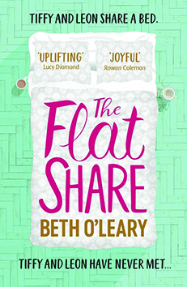

Beth O'Leary's *The Flatshare*, the bestselling romantic comedy, is a book of two faces; the exuberant and optimistic Tiffy contrasting against the pragmatic and candid Leon. This contrast in narrative voice and writing style gives two distinct protagonists with easily distinguishable personalities. This disparity debouches from within the story on the page to the typefaces on the cover.

The cover of the first-edition hardback features four different typefaces- the author’s name, the tagline and reviews, and the two in the title. Each one has a different purpose and style, yet the most important and enticing are those in the title of the novel (despite how nice the gold accents look on the bed).

Of the typefaces, the ones of greatest interest are those of the title, as these are the ones that are emblematic of the protagonists of the story. *The Flat* is a lightly-flourished, serifed cursive with the impression of movement to it, and a more handwritten feel for a more personal touch. This is Tiffy, her flamboyance and desire to progress in her life and move away from the circumstances that placed her in the flatshare.  Leon is the *SHARE* section of the title. His blunter sans-serif is supportive within itself as a word even as it falters, yet remains more stable than Tiffy's. With capitalisation on every letter as well, Leon's *SHARE* is still quite straightforward in a way that lends itself to his shortened, to-the-point narration. Yet in contrast to this gruff, abrupt nature of his "voice", the rounded nature of certain corners of the letters shows his softening and gentler nature indicated both in his interactions with Holly and Mr Prior at work, as well as with Tiffy and his phone conversations with his brother Richie. 

However, the two fonts are drawn together (as the characters themselves are) by two things. Firstly is the fact that, as shown in the cover art, the two are literally in bed together due to their unorthodox rental agreement. The second is, surprisingly, the varied line weight in the words. Tiffy's provides an almost-calligraphic edge to her font as she perseveres and the "pen" flows. In comparison, Leon's typeface features thinner crossbars in almost all his letters, perhaps also an indication of emotional fluctuations during the books where he shifts from his standard mindset of "Just keep it together". Or else these narrower lines could also be where he has been worn down by his responsibilities to brother Richie, girlfriend Kay, and his mam.

Cover designers may have deliberately created the uneven split of the type to show how Tiffy gradually influences Leon and changes his life- beginning by covering the flat in her belongings upon arrival, just as she takes over the title. Meanwhile his placement at the bottom shows the strong foundation he provided for her to come to terms with issues pre-existing the novel and allowing her to grow. This behind-the-scenes aspect is continued in the book as it is Tiffy that has a greater amount of agency within the story that gives her the lead in guiding the plot and therefore allows her to lead it and Leon into unfamiliar territories by being a welcome yet disruptive influence on his stability.

The imagery of the cover also evokes the domestic setting O'Leary bases her novel in. The background is patterned to mimic flooring beneath the bed, with the shadow falling from the bed (b4dad6 in light, 9dd0c8 in shade). Mugs sit either side, with evidence of rings by the empty teacup and saucer (likely Tiffy), and another opposite (with some left, as Leon is like to to do). This adds to the sense of cohabitation as they share the bed (though not simultaneously according to their rental agreement).  The bed is made, dressed in plain yet faintly patterned fabrics that provide clear contrast to the pink (cb1759) and gold (b89332) of the typefaces. Nothing is exceptional or especially ensnaring aesthetically speaking. The main focus of the cover is the lettering in its many colours and forms.

Whether these typographic choices were conscious decisions on the part of the design team, or simply fortuitous coincidences, one thing is clear; the two title fonts juxtaposed with the simplistic yet appealing background give an interesting view into the personalities of the characters that serves as an extension of their voices and attitudes within the text itself.