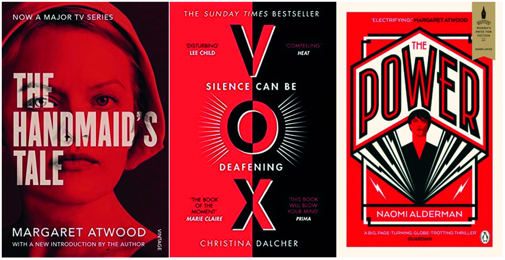

What similarities exist between these three novels? All three were written by female authors. All three have made their way onto award shortlists. All three are dystopian novels focusing on a dramatically different to our society, thanks to a drastic alteration to the power structure between genders. Yet the plots vary, the authors of different ages and intents, and the protagonists' voices are dissimilar. So why are the three reminiscent of one another?

The three are have "similar" paratextual elements in some regards. In these editions, all three prominently feature a bold and vivid red, with black and white playing lesser accompanying roles. All focus on the title as a, or even *the*, major element of the cover's layout. This could be for one of two reasons. The first being that for each book, the title is the focus of the plot. Atwood's *The Handmaid's Tale* is, according to Atwood's introduction, "the literature of witness"; recorded musings of an escaped Handmaid from Gilead, an extreme and violent patriarchy. Alderman's *The Power* questions what would happen if women suddenly gained a physical advantage over men, and how would this change society? And *Vox* by Daschler follows the story of a woman in a country where women are silenced by law. All three have titles that encapsulate the focus of the book. The second being that the cover designers are attempting working for similar templates in order to appeal to the same target audience. Vintage Classics released this edition of *The Handmaid's Tale* in 2017, when it was widely sold in supermarkets as the television series was released. The publishing house HQ released this edition of *Vox* in 2019, and Penguin released this cover for *The Power* in 2016. All three are female-centric dystopias focusing on gender politics for the YA and adult markets, thus are marketed towards the same demographics. By using the same styles and imagery, it will likely assist in attracting the same customers, making this an excellent reason to ensure congruity between the cover designs of these books.

Another comparative point is the bold typeface the three covers feature, those their titles are printed in. Stereotypically, novels with female narrative voices are considered more 'floofy' and feature calligraphic cursive scripts for their titles (possibly because many of those prominently feature romance, which traditionally lends itself to something typographically softer). Yet these are bold, blunt capitalised titles that are almost-stamp-like in their nature- not a style typically associated with the feminine. Sans-serif declarations that demand attention in the way the women of these stories often cannot (*Power* featuring a number of exceptions as the story progresses). This blunt manner also emulated fonts used by propaganda and government writings, and emulated by a number of dystopias, giving it an authority lacking in the presentation of women in many works of literature. It also represents the way these women are facing the realities of their settings- Offred escapes her reality through fleeing into memories but does not deny what happens around her in Gilead (with the exception of her time with Nick); the victimisation and assaults the characters in *The Power* are subjected to are recognised for how they affect these characters rather than the protagonists shying away from them; Jean faces the realities of the 'Pure' lifestyle as she stands witness to her daughter's enforced silence. The frill-less presentation of the narrative is emulated in the title typeface for each of the books.

A final commonality is the size discrepancy in the words themselves. The TV adaptation edition of Atwood's novel lacks its accolades and awards, and has all details but the title in a smaller size and more slender font, with the author's name an intermediary between the two. Everything not wholly of the novel has been sidelined to focus on *The Handmaid's Tale*. Even the television series' protagonist becomes background to the story and its title. Unlike with Atwood, Alderman has more ornamentation on her cover, with the lightning bolts of power and prominent female figure featured. This book also has reviews where the previous did not- likely as Alderman is less renowned. Yet as with the first example, all information but the title (author, reviews, logo) are minimised in size and line density, as though attempting to leave the majority of the attention with *The Power* of the title. Finally is *Vox.* More text-heavy than its compatriots, either because of its message of using words to enact change or because this was Daschler's debut so needed the draw or others recognising her quality. Between all three books however are the similarities of large, prominent bold titles with all other information in a thinner, smaller, but still entirely capitalised typeface. They ensure their focus is clear, visible and central through the fonts used for their text.

Despite all the similarities and differences of the cover, the fact remains that these are three distinct stories whose main link is their genre, which is part of likely why they resemble one another so much. But their typefaces are a major part of their message, marketing and presentation.