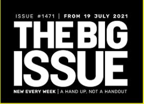
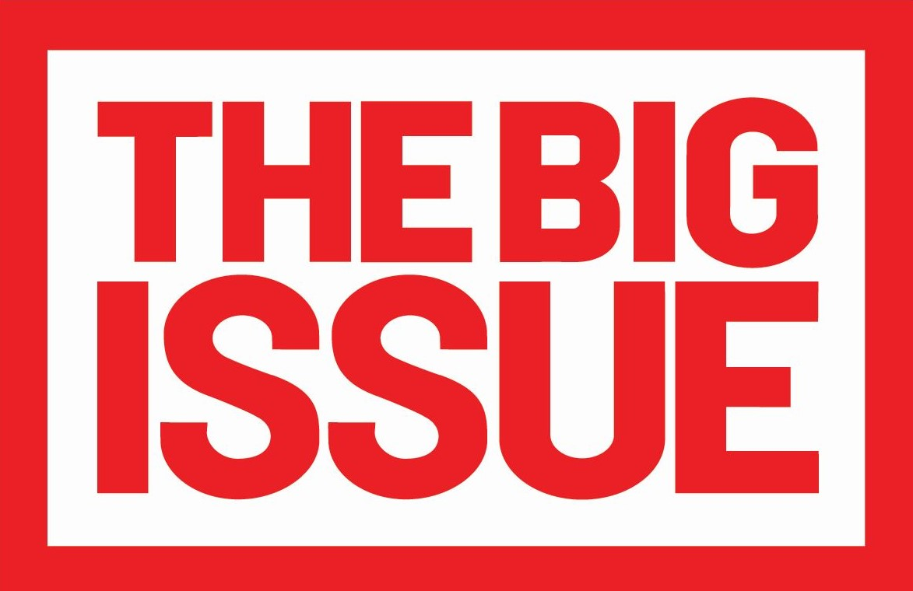

For those (hopefully few) who are unaware, The Big Issue is a charity working to assist the homeless population by helping foster an income- the sale of a weekly magazines for £3 per copy. The organisation has been running for nearly thirty years, and work hard to make it clear their goal is to be "A Hand Up, Not A Handout" for those struggling.

The logo on the cover of their weekly magazine is very simple. A monocoloured block containing large sans-serif, bold type in all capitals without contrast in weight. It is almost more of a statement than a logo, demanding that people recognise the problem rather than dismiss it or marginalise its victims. Yet despite the intense, upfront nature, the title is an allusion to the problem rather than a declaration of it. Perhaps because the brand and sellers make the problem clear without the need for the title to state it at this point? Or perhaps because the charity phrases it thus to encourage the public to acknowledge the severity of homelessness and housing insecurity themselves?

Information around the title is less "confrontational". The lower size and thinner line weight avoid diverting attention from the main title, while remaining in the same typeface to provide a more cohesive design. These details are differentiated within themselves as well. The issue number and tagline are not in bold, unlike the rest of the logo, but remain monospaced despite the different line weight, adding a point of interest without contrasting in a jarring manner.

The traditional logo encapsulates the title of the magazine, as it is almost a replica. There are only two differences: the colour, and the box. A vibrant red replaces the previous black. There are two main possibilities as to why. The first is aesthetic; the black-and-white will pair better and be more legible on the variety of designs on the magazine covers. The second is to attract attention. A bold red logo is more likely to catch attention due to human colour recognition; red is a danger colour that demands attention. Exactly like the intentions of the charity, drawing attention to the risk homelessness poses to society and its victims.

Within the covers are an assortment of fonts, varying greatly between and within the layout of the page. These are chosen, presumably, to suit the context of the articles and theme of the issue. The variation is incredibly vast across the hundreds of issues published, with novelty fonts featuring heavily in the repertoire of the charity. However, the fonts within the pages tend to be uniform across the articles. 

Type in *The Big Issue* is not particularly captivating.