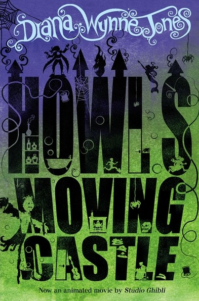

*Howl's Moving Castle* tells the tale of Sophie Hatter, a young woman cursed with age, who goes on a quest to regain her youth. She makes a deal with living fire, becomes the bane of a renowned and feared sorcerer's life, and grumbles about spiders. So why does this vivid fairytale have a clunky block font for its title, a dramatic and ornate swirl for the author's name, non-descript high contrast for the tagline, and enough illustrations for at least four less adorned covers? Why is it all details are black and white blocks on the purple-to-green gradient? Why are all illustrations simple silhouettes? Because, much as Jones combines simple commonplace elements of fairytales into something new, so cover designer Nina Tara creates a unique style only seen on the other books in the *Land of Ingary* series.

Only the font style use for the author's name is typical of the genre. The stark white shows clearly on the purple-to-green and is directly opposing all other features on the cover. It separates the author from all over components, like an omniscient cloud narrating Sophie's life, or an incredibly shaped wisp of smoke from the castle's chimney. Something above the story, yet present. The characters themselves are incredibly decorative, with each word having four to eight swirls. No opportunity is spared, as serifs and counters are just as liable as the traditional ascenders and descenders. The typeface is the only font on the cover that matches the fantastical and bizarre tone of the story, yet is bizarrely the second-least interesting feature of the design.

The smallest characters of the book is the tagline. As it proclaims, *Studio Ghibli* released an adaptation of the novel in November 2004, which received a positive reception among both the citizen and professional critics. This high-contrast serif font has a professional tone incongruous with the reverie of the plot and the no-nonsense attitude of Sophie's narration. Yet it does fit when considering the story as a fairytale. Similar fonts glimmer in gold, embossed on hardback covers from which Anderson, Grimm or Perrault lurk within among the beasts of lore. This small sized lettering also matches the styling of titles on numerous *Studio Ghibli* Miyazaki film covers, including popular *Spirited Away* and *Castle in the Sky*. Thus the choice for lettering is likely about matching tone to word while pairing with compatriots of its genres.

However, the strangest of the types featured on the book is undoubtedly the title. Although aesthetically not as odd as that of Jone's name, it is atypical of a children's fantasy book. This capitalised font has three forms- straight and standard on the spine, straight and illustrated, and the illustrated one on the cover, designed as if for a vanishing point. The spine is the template for the other two: a bold sans-serif type without contrast in its weight. On the spine, the lettering contains no illustrations; it is merely adorned by them. The type more closely resembles that of a crime or mystery novel- not at all befitting a fairytale. And yet when the plot is considered from Sophie's persepctive rather than the genre, it suits. Sophie spends her time in the castle searching for a solution to her curse, for Calcifer's bargain, for the missing prince and wizard, for the hearts Howl is rumoured to have harvested from young women in order to eat. She is endlessly investigating for the truth, much as a detective in a crime novel would. The layer of scrutiny Sophie's explorations place on the novel mean that, within the context of Ingary (suspending the knowledge that the book is fiction) this is a crime novel. Wynne's name is the only type pertaining to fantasy because she is the link from our world into the fiction she has spilt onto these pages. The reader joins her in that fantastical swirl, observing and enjoying the misadventures of her cast. And it is the starkness of this font that allows a true appreciation of the illustrations' romping across the title.

It is undoubtedly these silhouette illustrations that captivate the attention of its audience.