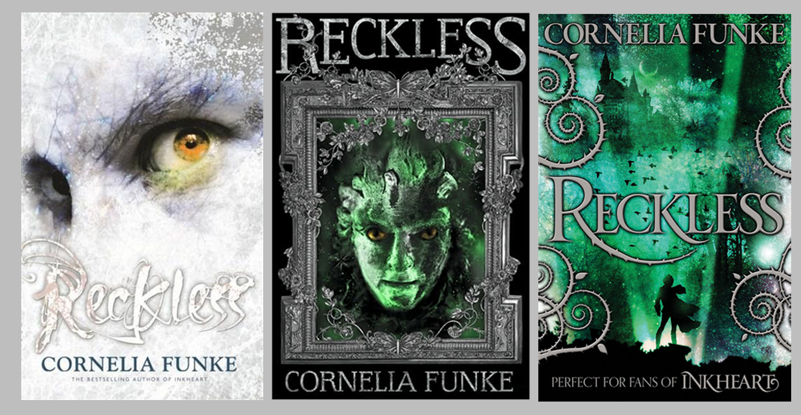

Cornelia Funke left the world of *Inkheart* and dreamt up Jacob Reckless' *MirrorWorld*. This land joins our own through windows, such as the mirror Reckless finds in his late father's study. It leads to a world of fairytales- but far more Grimm than Disney would want to get out. Goyls (presumably a derivation of the gargoyle), Bluebeards, kelpies, murderous unicorns, faeries (of old, with morals of their own, and punishments for betrayal), curses, enchantments, bespelled items and hexed trinkets. All this only a mirror away- provided you are brave- or reckless- enough to go through. Yet six years after its release, the *Reckless* series became the MirrorWorld, and its style underwent as much of a change as Jacob's reputation does when crossing worlds. How did this rebrand impact the covers? And, as the fourth novel peers through from November, is it still a reflection of the book?

Upon its release in 2010, Funke had two separate hardbacks released. One with Little Brown, featuring the Goyl-jade skin of Will, gazing back at the viewer from the mirror through which the curse resides; the other, from Chicken House, fixes golden-amber eyes upon the reader from the glimmer of marble-like skin, the expression seemingly that of prey both angered and panicked. Then yet another cover was created for the 2013 paperback editions following the release of its sequel *Fearless*. So with two books and an assortment of covers to choose from, what happened? Why the about-face to this?

According to *The Bookseller*, Funke moved from Chicken House (and US counterpoint Little Brown) to Pushkin Press based on editorial disputes regarding the third novel. As a result, the novel was transferred to new teams with new ideas, inspirations and tastes. These new covers and titles are likely a result. The Pushkin team redesigned the books of Lionel Wigram's translations of Funke's work into English in order to stamp their own mark on them in preparation for the continuation of the series and create a fresh start with Funke and her works. It may also have been necessary if the cover designers or the original team were less willing to share and pass-over their works.