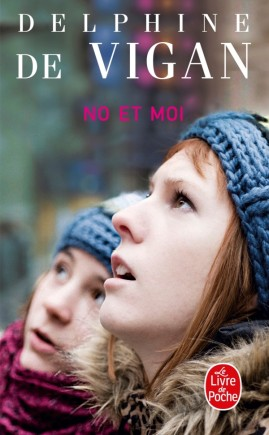

People often compare British and American book covers, comparing their colouring, imagery, and type. So how do French and English covers compare? Delphine De Vigan's *No et Moi* is a touching emotional story about intelligent but lonely young adolescent Lou Bertignac and her efforts to help homeless older girl Nolwenn get back on her feet. Lou struggles to support No while her parents mourn her deceased sibling and No battles with her mental health. This realistic and optimistically narrated tale won the Prix des Libraires in 2008, contributing to the creation of its film adaptation in 2010. So how do the native French and UK translation covers differ, and how do they represent the story?

France's *Le Livre de Poche* imprint will serve as the country's representative. The design is simple and lacks decorative elements. A photograph, presumably from the film adaption, serves as background and focal point. No and Lou stare at something offscreen, in matching knit hats. No is in focus in the foreground, looking up. Meanwhile Lou's blurred face is in the background, head craned slightly to see what No sees. The two cover the page as they fill and guide the plot of le roman. Other than the necessary text to identify title and author, the only other adornment is the imprint logo in the bottom corner. Of the text, the two typefaces contrast greatly.

*No et Moi* is a simple, sans-serif capitalised type in pink. It is reminiscent of a font to be used in the presentation Lou is working to at the book's beginning, as if De Vigan borrowed the character's working title for her book. Or perhaps it is how she imagines Lou catalogues their time together in her head. Either way, this simple declarative title rests beneath De Vigan's name in a typeface that makes the directness of the title and the story narration in its lack of frill. It suits the straightforward, socially awkward and inquisitive style of Lou's narration of events. The pink of the title (hexcode e4056f) is similar to that of Lou's scarf, and the blurred pink behind De Vigan's name. Much like the eponymous characters, it is both a statement and background colour. No is a member of *les sans domicile fixe,* a feature of the cityscape that is intentionally ignored, accidentally overlooked, or charitably assisted. Lou is a quiet, intellectually precocious, socially awkward child with a difficult family life. Both characters are in the odd state of standing out as unusual and blending into the background- just like this shade of pink. So every aspect of the title suits the characters named in it, and therefore pairs well with the story.

De Vigan's name is more elaborate, but still not particularly excessive, and contrasts greatly against that of the title. The sizing changes for each word, as if building up to De Vigan's final name. The weight is varied, with certain strokes (such as the of the V) being as slender as the serifs while others (including the bowl of the Ds) are at least treble the thickness. Contrast, in this typeface, provides a more 'traditionally French' (to this Brit) aesthetic.  This combination also creates a more sophisticated tone than that of the story. Combining this with the colouring of De Vigan's lettering, a stark white (hexcode fafff8), the author is distinct from both story and novel. She, and the brand logo in the corner, are the anomalous elements, as they do not exist as part of the narrative but as the paratext and context.

As with the markets, the British cover differs greatly from the French. This Bloomsbury ebook edition is again one simple image, an edited photograph, but the English one has far more extraneous text, and some very different typefaces. Even the blurb changes significantly between the original and the translation.

Beginning the comparison is the image. Here, the focal image is a place rather than people. The blurb features the train station where No and Lou meet, with the cover reflecting this location. The lamppost features a sign such as you would see at a station, though the style is not common. It does, however, match the ornate style of the buildings at the bottom of the cover, implying it suits the neighbourhood the novel is set in. The cover focuses on setting rather than character. It also features more detail and aspects than one headshot of two enthralled teenagers.

As with before, the title both stands out and fits in. Here, the blunt colours help it to stand out. The vivid red and stark black contrast against the pale blues and greens fading to white. Again the title matches the characters as both blending into and remaining separate to their surroundings. Yet here, the text is more blockish and appears to be a white canvas behind a red stencil, complete with screws(?) to pull the red into the lamppost sign. The letters are in two typefaces, with 'No' and 'Me' being different to the central 'And'. The girls' titles are simpler and harsher than the bridge between, with clean straight lines and the only rounding appearing on the corners of the O to soften it from seeming too much like a nought. The contrast is not apparent, as the line weight appears inconsistent in the 'Me', the E being more slender than the M. No is presents herself as a solid person, grounded and comfortable (or at least wholly aware) of who she is. Lou however is uncertain of herself, second-guessing thoughts and full of questions on the how and whys to avoid mistakes. Though the type is paired to setting rather than character, it is still (seemingly) tweaked to suit those involved.

Both versions of De Vigan's name utilise similar typefaces. They feature similar styles of contrast, shaping, serif usage make the texts almost identical. Yet there are differences. Primarily colour and sizing. Black stands out as clearly as the white on the previous but is its opposite. As the white stood out against the blurred darker colours on the French edition, so did the black against the paling of the sky. The colours were likely chosen for their contrast above other considerations.

The final aspect of this cover is the additional text. Like Le Livre De Poche, Bloomsbury places themselves on the front of their product. However Bloomsbury is far more subtle in their stamp, with white slender monospace type in their signature font gracing the bottom left. This in direct contrast with the bold red stamp of brand on that of the French edition. Though this may simply be the differing styles and signatures of the publishing houses rather than catering to the tastes of the international markets. (But is it not the purchase of a brand to meet the needs of its market to remain in business, therefore making this a reflection of the preferences of the market?) Yet the greatest deviation is in the advertising on the front cover. 

On the Bloomsbury edition, there are three pieces of promotional text designed to stir reader interest- two reviews from major publications, on literary acknowledgement