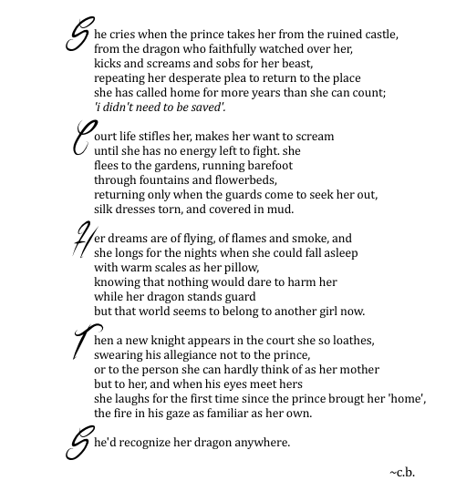

Once upon a time, people began to tell fairy tales... and they never stopped. Short stories, allegories, folk tales, myths, fables. The list goes on, and we today continue to evolve this as new forms of technology become increasingly accessible. But one of the oldest is the poem, the briefer cousin of epic ballads such as *Beowulf*. Public perception of poetry shifts, ranging from elitist to dismissive. So how is a fairy tale changed when it takes on a poetic format?

*The Goblin Market* by Christina Rossetti is one of the most recognisable older fairy tale poems. The 1862 story follows two sisters during their encounters with the fae and the resulting consequences. It resembles the traditional versions in lexicon (though this may be due to the greater temporal proximity between them and the ‘originals’) and theme. Rosetti’s protagonists follow the concept of wisdom contrasting foolishness; one sister resists temptation and has to undergo dangerous situations to rescue a companion from their poor decisions, as in *Little Brother, Little Sister* or *Hansel and Gretel*. It also continues the tradition of faerie food posing a serious threat when consumed. However, the tale does deviate from the classics. Unlike traditional stories, the poem contains far sensory descriptions, particularly in the visuals of the food and characters and physical elements of sensation, making it far longer than standard stories. The poem is also intentionally unusual in style, according to [Roe's 2014 analysis](https://www.bl.uk/romantics-and-victorians/articles/an-introduction-to-goblin-market), thanks to its “experimental form” in rhyme, rhythm and structure. Thanks to these changes and Rossetti’s details, *Goblin Market* becomes far more immersive than the more emotionless stories collected a century earlier. They also cause the poem to remain distinct from its prose cousins, as well as its contemporary counterparts.

Carol Ann Duffy is a well-known modern poet, having written multiple collections and won awards and accolades for her writing. Her 1999 work *The World’s Wife* is a subversion of original tales of myths and, as it reflects on them from the perspectives of their female partners and the silenced women of legend. Of the thirty poems, two are reimaginings of fairy tales. *Little Red Cap*’s protagonist follows the wolf into the woods voluntarily, seduced by his words and seeking some private tutelage. Eponymous Mrs Beast, meanwhile, describes her dominance in her relationship, and her husband’s dedication to their partnership and her pleasure.  These women are active in their relationships with the men, predatory in their pursuit of their goals and pleasures. They are unafraid and unashamed of the situations they place themselves in, whether it be the all-female poker game of fairytale spouses waited on by meek partners, or the murder of the wolf before emergence from the woods. We hear it from their voices, reading these stories from a feminist perspective that gives these protagonists agency and alternatives to the standard ‘love at first sight’ of a fairy tale. Duffy’s fairy tales possess more emotion and far more listing, just as Rossetti’s did (though that does seem to be something Duffy uses across her works). Yet it also utilises first-person narrative and this idea of owning sexuality in a way traditional stories do not. This reclamation of narrative continues into other modern poetry across formats and between authors.

Internet, especially Instagram, poetry is a popular genre, and has spawned published writers exploring the fairy tale space. Nikita Gill and Amanda Lovelace are to such poets; having begun online, their work gained enough attention to draw the eye of publishing houses that went on to produce physical editions of their work. Gill's *Fierce Fairytales* takes traditional stories of childhood and, like Duffy, retells them from alternative perspectives. These narratives humanise villains and return autonomy to previously passive or foolish protagonists. Captain Hook is seeking revenge for a callous teenage heartbreak; The Hatter's madness was induced by gaslighting; the princess was put in the tower to prevent her becoming the dragon. Gill takes classical fairy tales and shapes them into feminist narrations. This fits the current trends of casting older stories in the moulds of contemporary ideals and perspectives, as well as that of retelling the stories from the antagonist's perspectives. The stories are shortened by this format, but still comparatively long when framed in context of the original pieces. And Gill inserts far more emotion into the narrative than the centuries-old versions (Rossetti, for example, had less emotion in the telling despite the greater violence) . Her language places you as observer rather than empath, watching rather than experiencing Laura's longing and Lizzie's suffering. Gill's stories become more personal and emotive than their inspirations.

Meanwhile, Lovelace also uses these tropes as a foundation for her own work in imagery and plots, yet rejects the genre itself. Fairytale imagery pervades her works, especially the *women are some kind of magic* series from Andrews Mcmeel Publishing. The big bad wolf, the evil queen, dragons and mermaids and princesses and mirrors and flowers and towers and shapeshifting all appear in her first collection *the princess saves herself in this one*. Lovelace however makes a point to clarify that these are not fairy tales. Her lengthy trigger warning forewarns of the dark content explored far more vividly and more emotive language than traditional tales. The wolf won't eat you, but will consume you whole. The mother is the evil queen, but you miss her at the story end, because you're human. The prince can't save you, and sometimes he won't try. The sections of 'the princess', 'the damsel', 'the queen' and 'you' track the growth of Lovelace as she grows through. This book is an stylised autobiography reliant on the shaping of internet poetry, where she grew her audience, and the fairytale tropes used to make it more bearable and connect with the audience while attempting to dissociate from the nightmares. Nothing but the names are a fantasy. Yet fairy tales still influences everything in this books from the words on the cover to the phrasing of the poems to the titles on almost every page. Fairy tales in poetry moved beyond reimagining the classics into an outlet and mode of connection between creator and audience.

It isn't solely published writers who reimagine fairy tales using the poem format. The poem below is from [Tumblr user fioren-nights](https://fioren-nights.tumblr.com/post/128616392320) and bases itself on the trope of 'princess rescued from a dragon in a castle'. The blogger considers how the narrative of the story would change if the slayed dragon were to be a beloved companion of the princess.

The poem remains fairly similar in phrasing and style to standard storytelling, but adopts a number of modern internet poetry themes. The lack of typical capitalisation despite caesura; longer sentences than that of prose; use of standard, conversational lexicon rather than more formal specialist lexicon. All of these appear commonly in Instagram poetry as aspects of the genre.