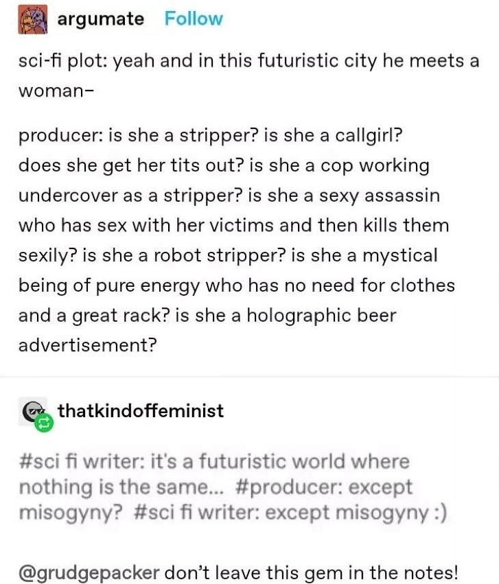

Reading *The Long Way to a Small Angry Planet* was not the book I expected, and for that I am grateful. Although I had seen it many times over the years in digital shops, I had written it off as another book about how Earth was crumbling around us and the eventual, inevitable demise of humanity. Instead, it is an interplanetary, intersectional, intriguing science fiction. But it is the characters not the plot separating this novel from its genre contemporaries and predecessors; it is the characters Chambers introduces her audience to.

The first of the *Wayfarer* series has the tone of a classic science fiction. A new person joins  a ship for mysterious reasons before embarking on a long quest through space with their interspecies crew, encountering aliens and escaping danger to reach their goal. This is the plot of many a sci-fi novel and film. What makes this one different?

This tweet is amusing in how typical it can be in the genre. Shared by @bookish.you.should.know and @smarterthantheaveragebook on Instagram, it reveals a common problem in the films.

I had a similar thought upon the first conversation in the book- about the introduction of racism and xenophobia between species. A common trope. Yet Chambers makes a conscious effort through the perspectives of multiple characters to make it clear that it is unacceptable among the crew and the GC (*Wayfarer*'s equivalent of Star Trek's Federation or Star Wars senate), with some chapters making it a point to talk about how the immediate comparisons and othering are moved beyond quickly in most cases.